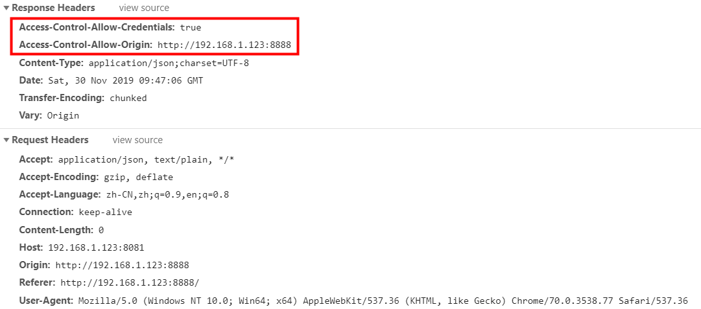

# 启动 zookeeper
- 上传zookeeper-3.4.11.tar.gz到linux服务器/opt目录下
- 解压
- 配置
```
cd zookeeper-3.4.11
mkdir data
cd conf
cp zoo_sample.cfg zoo.cfg
vi zoo.cfg   #修改zookeeper数据路径
dataDir=/opt/zookeeper-3.4.11/data 
```
- 启动
```
cd /opt/zookeeper-3.4.11/bin
./zkServer.sh start
./zkServer.sh status
```

# tomcat启动dubbo-admin项目
- 下载apache-tomcat-8.5.24.tar.gz，dubbo-admin-2.6.0.war，上传到linux服务器/opt目录下
- 解压
```
cd /opt
tar -zxvf apache-tomcat-8.5.24.tar.gz
unzip dubbo-admin-2.6.0.war -d dubbo  
```
- 配置server.xml
```
cd apache-tomcat-8.5.24
vi conf/server.xml
#<Host></Host>标签中添加如下内容
#访问路径/dubbo，项目位置 /opt/dubbo，request.getContextPath() ==> /dubbo
#可以多个tomcat同时指向一个项目，而不是放在每个tomcat的webapps下
<Context path="/dubbo" docBase="/opt/dubbo" debug="0" privileged="true"/>
```
- 启动，停止tomcat
```
cd bin
./startup.sh   
./shutdown.sh
```

# 使用docker镜像部署zookeeper,dubbo-admin
- https://blog.csdn.net/qq_33562996/article/details/80599922
- dockerhub账号dingkango，里面有dubbo-admin的封装镜像

# 使用 dubbo 注意点
- dubbo在进行dubbo协议通讯时，需要实现序列化接口（封装的数据对象）
- consumer在三秒之内每隔一秒进行一次重新访问，默认一秒钟超时，三次访问超时之后会直接抛超时异常。我们在开发阶段可以将consumer设置的超时延长，方便debug
- consumer启动时默认会检查注入的provider是否存在。否则报错。我们可以配置关闭掉检查。
```
# 设置超时时间
spring.dubbo.consumer.timeout=600000
# 设置是否检查服务存在
spring.dubbo.consumer.check=false
```
# gmall-admin前端
- nodejs,npm安装
- config/dev.env.js    修改后端地址，端口
- index.js   修改前端访问地址，端口
- 编译启动  cd 到 gmall-admin目录下 运行 npm run dev
# 跨域问题
<br>gmall-admin前端：127.0.0.1:8888
<br>gmall-manage-web后端：127.0.0.1:8081
<br>两者来自不同的网域，所以在http的安全协议策略下，不信任。需要任意一方加入跨域协议。
<br>后台解决方案：在springmvc的控制层加入@CrossOrigin跨域访问的注解。添加完成后注意看请求Response Headers中多出的部分


# 网段变化后，虚拟机中配置步骤
```
#配置固定ip，虚拟机内外网段保持一致
vi /etc/sysconfig/network-scripts/ifcfg-enp0s3
IPADDR=

service network restart

#fastdfs storage配置ip变更
vi /etc/fdfs/storage.conf
tracker_server= 

service fdfs_storaged restart 

# fastdfs-nginx-module 配置ip变更
vi /etc/fdfs/mod_fastdfs.conf
tracker_server=

# nginx 配置变更
vi /usr/local/nginx/conf/nginx.conf
server_name 

/usr/local/nginx/sbin/nginx
/usr/local/nginx/sbin/nginx -s reload 
```
# docker 安装fastdfs
```
docker pull morunchang/fastdfs
docker run -d --name tracker --net=host morunchang/fastdfs sh tracker.sh
#TRACKER_IP配置docker所在主机的ip
docker run -d --name storage --net=host -e TRACKER_IP=192.168.9.108:22122 -e GROUP_NAME=group1 morunchang/fastdfs sh storage.sh

docker exec -it storage /bin/bash
vi /etc/nginx/conf/nginx.conf
# 修改nginx访问 监听端口和server_name
listen       80;
server_name  192.168.9.108;

#重启storage

```

# fastdfs-client-java
<br>git clone后拷贝到gmall项目下，file->new->module from existing sources ->选择fastdfs-client-java->选择maven 
<br>maven install 装到仓库后即可删除。
<br>gmall-manage-web中 maven dependency引入