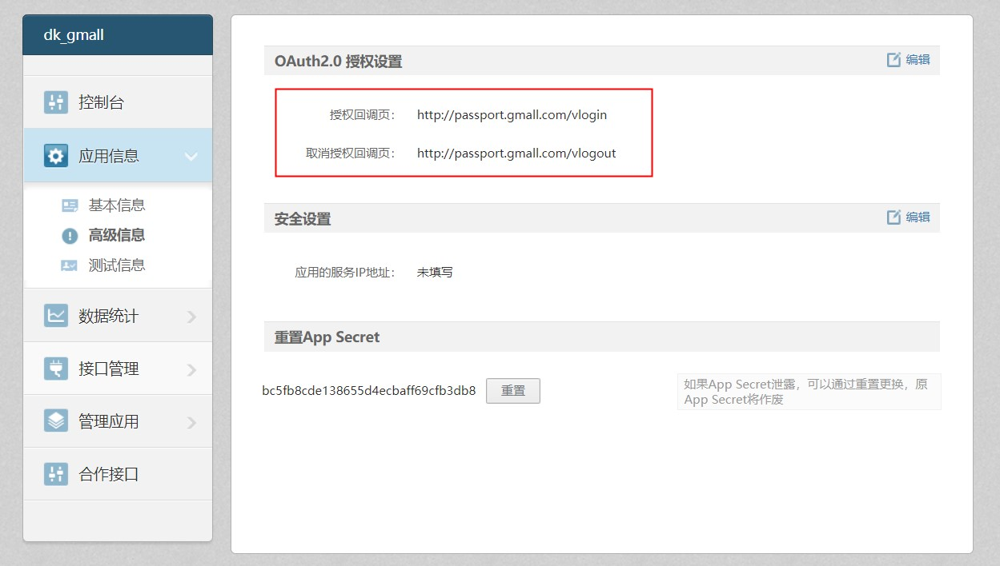
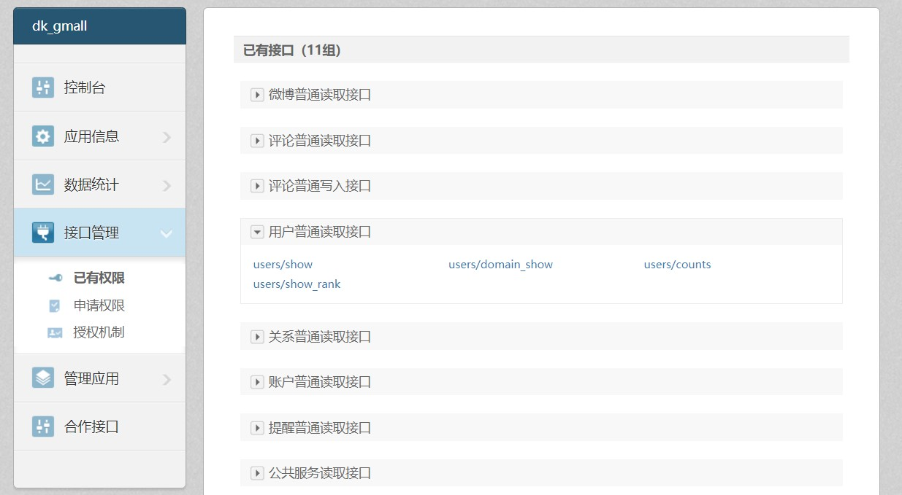

# linux jdk 环境变量配置
```
vi /etc/profile
# 添加如下内容  JAVA_HOME=jdk解压地址
export JAVA_HOME=/opt/jdk1.8.0_161
export JRE_HOME=${JAVA_HOME}/jre  
export CLASSPATH=.:${JAVA_HOME}/lib:${JRE_HOME}/lib  
export  PATH=${JAVA_HOME}/bin:$PATH
# 配置生效
source /etc/profile
```
# 启动 zookeeper
- 上传zookeeper-3.4.11.tar.gz到linux服务器/opt目录下
- 解压
- 配置
```
cd zookeeper-3.4.11
mkdir data
cd conf
cp zoo_sample.cfg zoo.cfg
vi zoo.cfg   #修改zookeeper数据路径
dataDir=/opt/zookeeper-3.4.11/data 
```
- 启动
```
cd /opt/zookeeper-3.4.11/bin
./zkServer.sh start
./zkServer.sh status
```

# tomcat启动dubbo-admin项目
- 下载apache-tomcat-8.5.24.tar.gz，dubbo-admin-2.6.0.war，上传到linux服务器/opt目录下
- 解压
```
cd /opt
tar -zxvf apache-tomcat-8.5.24.tar.gz
unzip dubbo-admin-2.6.0.war -d dubbo  
```
- 配置server.xml
```
cd apache-tomcat-8.5.24
vi conf/server.xml
#<Host></Host>标签中添加如下内容
#访问路径/dubbo，项目位置 /opt/dubbo，request.getContextPath() ==> /dubbo
#可以多个tomcat同时指向一个项目，而不是放在每个tomcat的webapps下
<Context path="/dubbo" docBase="/opt/dubbo" debug="0" privileged="true"/>
```
- 启动，停止tomcat
```
cd bin
./startup.sh   
./shutdown.sh
```

# 使用docker镜像部署zookeeper,dubbo-admin
- https://blog.csdn.net/qq_33562996/article/details/80599922
- dockerhub账号dingkango，里面有dubbo-admin的封装镜像

# docker部署mysql
```
docker run -p 3306:3306 --name mysql -v /root/docker/datadir/mysql:/var/lib/mysql -e MYSQL_ROOT_PASSWORD=123456 -d mysql
```

# 使用 dubbo 注意点
- dubbo在进行dubbo协议通讯时，需要实现序列化接口（封装的数据对象）
- consumer在三秒之内每隔一秒进行一次重新访问，默认一秒钟超时，三次访问超时之后会直接抛超时异常。我们在开发阶段可以将consumer设置的超时延长，方便debug
- consumer启动时默认会检查注入的provider是否存在。否则报错。我们可以配置关闭掉检查。
```
# 设置超时时间
spring.dubbo.consumer.timeout=600000
# 设置是否检查服务存在
spring.dubbo.consumer.check=false
```
# gmall-admin前端
- nodejs,npm安装
- config/dev.env.js    修改后端地址，端口
- index.js   修改前端访问地址，端口
- 编译启动  cd 到 gmall-admin目录下 运行 npm run dev
# 跨域问题
<br>gmall-admin前端：127.0.0.1:8888
<br>gmall-manage-web后端：127.0.0.1:8081
<br>两者来自不同的网域，所以在http的安全协议策略下，不信任。需要任意一方加入跨域协议。
<br>后台解决方案：在springmvc的控制层加入@CrossOrigin跨域访问的注解。添加完成后注意看请求Response Headers中多出的部分


# 网段变化后，虚拟机中配置步骤
```
#配置固定ip，虚拟机内外网段保持一致
vi /etc/sysconfig/network-scripts/ifcfg-enp0s3
IPADDR=

service network restart

#fastdfs storage配置ip变更
vi /etc/fdfs/storage.conf
tracker_server= 

service fdfs_storaged restart 

# fastdfs-nginx-module 配置ip变更
vi /etc/fdfs/mod_fastdfs.conf
tracker_server=

# nginx 配置变更
vi /usr/local/nginx/conf/nginx.conf
server_name 

/usr/local/nginx/sbin/nginx
/usr/local/nginx/sbin/nginx -s reload 
```
# docker 安装fastdfs
```
docker pull morunchang/fastdfs
docker run -d --name tracker --net=host morunchang/fastdfs sh tracker.sh
#TRACKER_IP配置docker所在主机的ip
docker run -d --name storage --net=host -e TRACKER_IP=192.168.9.108:22122 -e GROUP_NAME=group1 morunchang/fastdfs sh storage.sh

docker exec -it storage /bin/bash
vi /etc/nginx/conf/nginx.conf
# 修改nginx访问 监听端口和server_name
listen       80;
server_name  192.168.9.108;

#重启storage

#解决网段变化，宿主机ip更换后storage的TRACKER_IP配置问题
docker exec -it storage /bin/bash
vi /etc/fdfs/storage.conf 
# 修改storage配置文件中的tracker_server对应的ip 
# nginx配置同时也要修改

```

# fastdfs-client-java
<br>git clone后拷贝到gmall项目下，file->new->module from existing sources ->选择fastdfs-client-java->选择maven 
<br>maven install 装到仓库后即可删除。
<br>gmall-manage-web中 maven dependency引入


# idea启动多个实例
Edit Configurations -> Allow parallel run

# nginx 负载均衡
```
upstream redisTest {
        server   192.168.9.250:9001 weight=3;
        server   192.168.9.250:9002  weight=3;
        server   192.168.9.250:9003  weight=3;
}
server {
        listen       9000;
        server_name  192.168.9.108;

        location / {
                root   html;
                index  index.html index.htm;
                proxy_pass  http://redisTest;
        }
}
```

# 使用Apache压力测试工具
```
yum -y install httpd-tools
# ab [options] [http[s]://]hostname[:port]/path
ab -c 200 -n 1000 http://192.168.9.108:9000/testRedisson   # 并发200，共发1000次请求
```


# elasticsearch，kibana安装配置
```
mkdir -p /opt/es
# 上传安装包，elasticsearch-6.3.1.tar.gz  elasticsearch-analysis-ik6.rar  kibana-6.3.1-linux-x86_64.tar.gz
# 解压elasticsearch-6.3.1.tar.gz
# es6 root用户无法启动,创建其他用户,临时处理权限问题
cd /opt/es
chmod 777 -R elasticsearch-6.3.1
adduser es
su es
# 配置测试环境启动占用jvm内存空间，默认是1g， 如果jvm.options中没有内容，需要切换到root用户进行操作
vi /opt/es/elasticsearch-6.3.1/config/jvm.options
-Xms256m
-Xmx256m
# 配置外网访问url
vi /opt/es/elasticsearch-6.3.1/config/elasticsearch.yml 
network.host: 192.168.9.108
http.port: 9200
# 启动命令
/opt/es/elasticsearch-6.3.1/bin/elasticsearch
# 启动后退出控制台（后台启动）
nohup /opt/es/elasticsearch-6.3.1/bin/elasticsearch &  

报错
[1]: max file descriptors [4096] for elasticsearch process is too low, increase to at least [65536]
[2]: max number of threads [3868] for user [es] is too low, increase to at least [4096]
[3]: max virtual memory areas vm.max_map_count [65530] is too low, increase to at least [262144]
解决方案
[1][2]
ulimit -Hn  #查看nofile硬限制  -S 软限制
ulimit -Hu  #查看nproc 硬限制
su root   
vi /etc/security/limits.conf 
添加
es soft nofile 65536
es hard nofile 65536
es soft nproc  4096
es hard nproc  4096
# 用户重新登录（切换）生效
[3]:
vi /etc/sysctl.conf
添加
vm.max_map_count=655360
#然后执行命令
sysctl -p

#配置启动kibana
vi /opt/es/kibana-6.3.1-linux-x86_64/config/kibana.yml 
server.host: "0.0.0.0"
elasticsearch.url: "http://192.168.9.108:9200"
# cd 到 bin目录下，启动
nohup /opt/es/kibana-6.3.1-linux-x86_64/bin/kibana  &
# 查看进程id
ps -ef | grep kibana
ps -ef | grep node  
# 访问地址
http://192.168.9.108:5601
```
# elasticsearch分词器
将解压后的analysis-ik包放到elasticsearch-6.3.1的plugins目录下,重启es，kibana即可。

ik中英文分词器有两个:
1. ik_smart
2. ik_max_word


# elasticsearch集群配置
```
vi /opt/es/elasticsearch-6.3.1/config/elasticsearch.yml
# 集群名称（不能重复）
cluster.name: my-application     #必须相同 
# 节点名称，仅仅是描述名称，用于在日志中区分（自定义）
node.name: es1（必须不同）
#指定了该节点可能成为 master 节点，还可以是数据节点
node.master: true
node.data: true
# 数据的默认存放路径（自定义）
path.data: /opt/es/data
# 日志的默认存放路径 
path.logs: /opt/es/logs 
# 当前节点的IP地址 
network.host: 192.168.9.108 
# 对外提供服务的端口
http.port: 9200 
#9300为集群服务的端口 
transport.tcp.port: 9300
# 集群个节点IP地址，也可以使用域名，需要各节点能够解析 
discovery.zen.ping.unicast.hosts: ["192.168.9.107"] 
# 为了避免脑裂，集群节点数最少为 半数+1
discovery.zen.minimum_master_nodes: 2 

# 莫忘记创建指定的数据，日志目录,修改目录权限。
# 配置完集群，elasticsearch  config目录下会多出一个elasticsearch.keystore的文件也会出现用户访问权限问题。
# 使用cerebro-0.8.3查看管理集群，windows下启动即可使用。
```

# elasticsearch中 pms_sku_info对应数据类型的定义
```
PUT gmall
{
  "mappings": {
    "PmsSkuInfo":{
      "properties": {
        "id":{
          "type": "keyword"
        },
        "price":{
          "type": "double"
        },
         "skuName":{
          "type": "text",
          "analyzer": "ik_max_word"
        },
        "skuDesc":{
          "type": "text",
          "analyzer": "ik_smart"
        },
        "catalog3Id":{
          "type": "keyword"
        },
        "skuDefaultImg":{
          "type": "keyword",
          "index": false
        },
        "hotScore":{
          "type": "double"
        },
        "productId":{
          "type": "keyword"
        },
        "skuAttrValueList":{
          "properties": {
            "attrId":{
              "type":"keyword"
            },
            "valueId":{
              "type":"keyword"
            }
          }
        }
      }
    }
  }
}
```
# elasticsearch 复杂查询
- 查询前过滤


# 新浪开放平台
- 应用名称：dk_gmall
- App Key(YOUR_CLIENT_ID): 4127982357  
- App Secret(YOUR_CLIENT_SECRET): bc5fb8cde138655d4ecbaff69cfb3db8
- 授权回调页(YOUR_REGISTERED_REDIRECT_URI)：http://passport.gmall.com/vlogin
- 取消授权回调页：http://passport.gmall.com/vlogout



```
测试：
https://api.weibo.com/oauth2/authorize?client_id=YOUR_CLIENT_ID&response_type=code&redirect_uri=YOUR_REGISTERED_REDIRECT_URI
https://api.weibo.com/oauth2/access_token?client_id=YOUR_CLIENT_ID&client_secret=YOUR_CLIENT_SECRET&grant_type=authorization_code&redirect_uri=YOUR_REGISTERED_REDIRECT_URI&code=CODE

例子：
1.获取授权码
https://api.weibo.com/oauth2/authorize?client_id=4127982357&response_type=code&redirect_uri=http://passport.gmall.com/vlogin
返回结果
http://passport.gmall.com/vlogin?code=0b032e51f24d8c6ff8b0717497d875f3
2.换取access_token（post）
https://api.weibo.com/oauth2/access_token
?client_id=4127982357
&client_secret=bc5fb8cde138655d4ecbaff69cfb3db8
&grant_type=authorization_code
&redirect_uri=http://passport.gmall.com/vlogin
&code=0b032e51f24d8c6ff8b0717497d875f3
返回结果
{
    "access_token": "2.005tqGmDbma3VE277b3e6508uFESLC",
    "remind_in": "157679999",
    "expires_in": 157679999,
    "uid": "3459295914",
    "isRealName": "true"
}
3.获取user信息
https://api.weibo.com/2/users/show.json?access_token=2.005tqGmDbma3VE277b3e6508uFESLC&uid=3459295914&uid=3459295914
```



# alipay开放平台

[电脑网站支付文档](https://docs.open.alipay.com/270/105899/)

[公钥私钥生成文档](https://docs.open.alipay.com/291/105971/)


# activemq
启动
<br/> cd /opt/activemq/apache-activemq-5.14.4/bin
<br/> ./activemq start
<br/> ./activemq status 查看运行状态 
<br/> ./activemq stop   关闭
<br/>访问控制台
<br/> http://192.168.1.107:8161/admin/
<br/> 用户名，密码：admin

<br/> 开启延迟队列: conf/activemq.xml


